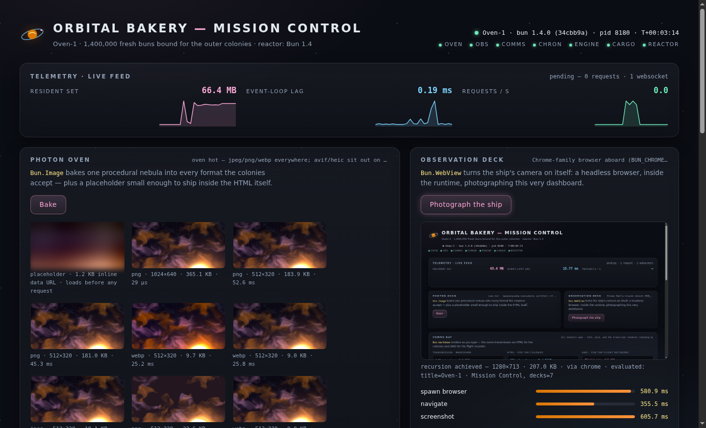

# 🥐 ORBITAL BAKERY — Mission Control for Bun 1.4

The **Oven-1** is a bakery in orbit: a zero-dependency spacecraft on a mission to deliver
**1.4 million fresh buns** to the outer colonies. This repository is her flight deck, and
**Bun 1.4 — the first Bun written in Rust — is the reactor.** Every deck of the ship is a
Bun 1.4 feature doing real work, measured live, on your machine, during your run.

No frameworks. No build step. `dependencies: {}`. Just Bun.

## Liftoff

```sh
git clone https://github.com/ubiquito/bun-demo
cd bun-demo
bun install        # dev types only — the dependency manifest is {}
bun start          # Mission Control on http://localhost:1414
```

Three more ways to fly:

```sh
bun run tour       # the Grand Tour: all eight decks plus the ship's physical, in order
bun test           # preflight checks (add --parallel for the full worker fan-out)
bun demos/01-photon-oven.ts   # any single deck, standalone — no server needed
```

Or take the one-click gangway: open the repo in a **Dev Container / GitHub Codespaces** —
[`.devcontainer/devcontainer.json`](.devcontainer/devcontainer.json) boards you onto the
official `oven/bun:1.4` image, installs a best-effort Chromium for the Observation Deck,
and forwards port 1414. Then `bun start`.

> **⚠️ Airlock advisory** — the Engine Room streams a **real interactive shell** over
> `/ws`. Two locks guard it: the flight deck berths on `127.0.0.1` only, and `/ws`
> accepts a **same-origin** upgrade solely (a cross-site page is refused `403`, so a
> tab you visit while the ship is flying can't reach the shell). Setting `HOST=0.0.0.0`
> (or any non-loopback address) still opens the outer airlock — anyone who can reach
> the port can run commands as you — so do that only on a network you'd trust with your
> own terminal, never on the open internet.

## The decks

| Deck | Bun 1.4 feature | Module | Standalone demo |
| --- | --- | --- | --- |
| 🛰 Flight Deck | `Bun.serve` + HTML imports + WebSocket pub/sub | [`src/server.ts`](src/server.ts), [`src/ui/`](src/ui) | `bun start` |
| 🥐 Photon Oven | `Bun.Image` — resize, modulate, formats, placeholder | [`src/systems/photon-oven.ts`](src/systems/photon-oven.ts) | `bun demos/01-photon-oven.ts` |
| 🔭 Observation Deck | `Bun.WebView` — a headless browser in the runtime | [`src/systems/observation-deck.ts`](src/systems/observation-deck.ts) | `bun demos/02-observation-deck.ts` |
| 📡 Comms Bay | `Bun.markdown` — html / ansi / custom renderers | [`src/systems/comms.ts`](src/systems/comms.ts) | `bun demos/03-comms.ts` |
| 🕰 Chronometer | `Bun.cron` + `Bun.cron.parse` | [`src/systems/chronometer.ts`](src/systems/chronometer.ts) | `bun demos/04-chronometer.ts` |
| ⚙️ Engine Room | `Bun.Terminal` — a real PTY, streamed to the browser | [`src/systems/engine-room.ts`](src/systems/engine-room.ts) | `bun demos/05-engine-room.ts` |
| 📦 Cargo Hold | `Bun.Archive` + JSON5/JSONC/JSONL/XML/YAML/TOML | [`src/systems/cargo-hold.ts`](src/systems/cargo-hold.ts) | `bun demos/06-cargo-hold.ts` |
| ☢️ Reactor | mimalloc-era memory, throughput, startup race | [`src/systems/reactor.ts`](src/systems/reactor.ts), [`src/telemetry.ts`](src/telemetry.ts) | `bun demos/07-reactor.ts` |
| 🌀 Hyperdrive | `bun run --parallel`, `bun test --parallel` | [`package.json`](package.json) scripts | `bun demos/08-hyperdrive.ts` |
| ✨ Grand Tour | all of the above, in sequence | [`scripts/tour.ts`](scripts/tour.ts) | `bun run tour` |

Every demo is self-contained: fresh clone, no server running, no flags, no env vars,
exits 0 in well under a minute. (The whole Grand Tour took **13.05 s** on our dev
container — your curtain call will print its own number.)

---

### 🛰 Flight Deck — `Bun.serve`

One process is the whole ship. `import dashboard from "./ui/index.html"` hands the entire
UI — HTML, CSS, client JS, bundled on the fly — to a single route, typed `routes` carry
every deck's JSON API, and one WebSocket streams telemetry out and Engine Room keystrokes
in via topic pub/sub.

```ts
const server = Bun.serve({
  port: PORT,
  routes: {
    "/": dashboard,

    "/ws": guard((req, srv) =>
      srv.upgrade(req, { data: { session: null } })
        ? undefined
        : new Response("this hatch only opens for WebSockets", { status: 426 }),
    ),
```

Run `bun start` and watch the deck panels light up as telemetry frames land every 500 ms —
rss, heap, event-loop lag, and CPU, all read from the live process. `bun run dev` flies the
same ship under `--hot`.

### 🥐 Photon Oven — `Bun.Image`

Sharp-shaped image work with zero npm installs. One `bake()` pushes a nebula through the
whole native pipeline: header-only `metadata()`, two resampling kernels (lanczos3 and
mks2013), a saturation glaze, four encoders, and a ThumbHash placeholder — every transform
off the JavaScript thread.

```ts
  await fire(
    outputs,
    `nebula-${w}-glazed.webp`,
    "modulate sat ×1.5 — strawberry glaze → webp q80",
    oven().resize(w, w, { fit: "inside" }).modulate({ saturation: 1.5 }).webp({ quality: 80 }),
    "webp",
  );
```

The nebula itself is the pantry's pride: painted from pure math (domain-warped fBm value
noise in the ship's palette, four-pointed stars, a sun cresting the frame) and encoded by a
from-scratch PNG encoder in [`assets/generate-nebula.ts`](assets/generate-nebula.ts) — own
CRC-32 and Adler-32, Sub-filtered scanlines, `Bun.deflateSync` for the IDAT. Seeded PRNG,
so every clone paints the byte-identical sky (sha256 `ec74bbd8…`).

What to look for: the full bake — seven trays from one source — landed in **~240 ms** on
our Linux container, the palette:64+dither PNG came out **7.8× smaller** than the
truecolor resize, and the ThumbHash placeholder is a ~1.2 KB data URL, **305× lighter**
than the source. And on Linux you'll see the AVIF tray take the *documented*
`ERR_IMAGE_FORMAT_UNSUPPORTED` exit to WebP — we demo the fallback itself, not around it.

### 🔭 Observation Deck — `Bun.WebView`

A headless browser that lives inside the runtime — no Puppeteer, no Playwright, no
download step. The demo builds a postcard page as a `data:` URL (no server, no files),
clicks it with **native input**, and prints the page's own verdict:
`event.isTrusted === true`.

```ts
    await using view = new Bun.WebView({ width: 1280, height: 800, backend: viewBackend() });

    // The constructor returns instantly; the first awaited op absorbs the
    // browser spawn. about:blank isolates that wait from the real navigation.
    await view.navigate("about:blank");
```

What to look for: cold spawn + first contact was ~1.1 s on our container (warm ~300 ms —
the browser is spawned once per process), a `data:` URL navigation lands in tens of
milliseconds, and a selector click in ~15–25 ms. Screenshot dimensions are read back from
the PNG header, never assumed. On the flight deck, this is how the ship photographs her
own dashboard. Running as root in a container? `viewBackend()` adds `--no-sandbox` for
you.

### 📡 Comms Bay — `Bun.markdown`

One mission log, three renderers: the built-in HTML and ANSI passes, and a fully custom
`Bun.markdown.render()` pass that re-keys the same document as a flight-deck transcript —
every block and inline element routed through a plain JavaScript callback.

```ts
      listItem: (c, { depth, checked }) => {
        const mark =
          checked === true ? paint(palette.mint, "▣")
          : checked === false ? paint(palette.hull, "□")
          : paint(palette.flame, "▸");
        return `${"  ".repeat(depth)}${mark} ${c.trimEnd()}\n`;
      },
```

What to look for: the ANSI pass syntax-highlights the log's TypeScript fence and draws
box-drawing tables out of the box; the custom renderer's `table` callback receives all
finished rows at once, so it column-aligns the cargo manifest post-hoc with
`Bun.stringWidth`. On our container the 1,982-char log rendered to HTML in ~130–180 µs —
**~21,000–26,000 full renders/sec** sustained over 1,000 renders, re-measured live every
run. The log is embedded with `import ... with { type: "text" }`, so no `fs` read ever
happens. (The log itself is worth the trip: the approved phrase is *unscheduled crumb
event*, and the sourdough starter is Commander Steve, age 43, temperament: bubbly.)

Note: `Bun.markdown` is flagged **Unstable API** in the official 1.4 docs, and
`headings`/`autolinks` default to off (GFM tables, strikethrough, and tasklists default
on). `Bun.markdown.ansi` exists on 1.4.0 but is undocumented in the shipped docs — we
verified it at runtime and use it anyway, because it's lovely.

### 🕰 Chronometer — `Bun.cron`

`windows()` charts when any schedule will next fire by *chaining* `Bun.cron.parse()` —
each returned `Date` feeds back in as the relative date, so upcoming windows come out
strictly ordered with zero date math:

```ts
    const next: string[] = [];
    let cursor: Date | number = Date.now();
    for (let i = 0; i < wanted; i++) {
      const hit = Bun.cron.parse(expr, cursor);
      if (!hit) break; // parseable, but no occurrence within 8 years (e.g. Feb 30)
      next.push(hit.toISOString());
      cursor = hit;
    }
```

What to look for: the same `0 7 * * *` parsed under `{tz: "America/New_York"}` vs
`{tz: "Asia/Tokyo"}` — two bakeries opening at 07:00 local, 13 hours apart on the mission
clock (measured live). A nonsense expression (`61 25 * * PIEDAY`) bounces off with a
precise `TypeError`, never a crash; Feb 30 parses but returns `null`. Then three ship
routines go on the wheel as in-process `Bun.cron` jobs — whose run counts survive
`bun --hot` reloads via a `globalThis` registry — and come off again before landing,
because live `CronJob` handles ref the event loop by default.

### ⚙️ Engine Room — `Bun.Terminal`

A real PTY in the runtime — no node-pty, no node-gyp. The demo runs the same command into
a pipe (the child plays it safe: zero ANSI) and through a PTY (the child believes, and
paints), puts a child under oath (`process.stdout.isTTY`), reuses one terminal across two
spawns, then wires the exact session the flight deck streams to the browser:

```ts
    const child = Bun.spawn({
      // --norc keeps dotfiles from repainting our PS1 mid-flight
      cmd: shell.endsWith("bash") ? [shell, "--norc", "--noprofile", "-i"] : [shell, "-i"],
      env: { ...process.env, TERM: "xterm-256color", PS1: PROMPT },
      terminal: {
        cols: COLS,
        rows: ROWS,
        data(_terminal, bytes) {
          relay({ type: "engine/data", data: bytes.toBase64() });
        },
```

What to look for: the shell greets you with a custom `oven-1:` prompt, does live arithmetic,
and exits cleanly — raw PTY bytes out as base64 envelopes, keystrokes back in. On the
flight deck the same session powers an interactive terminal in your browser tab — and is
the reason the server binds `127.0.0.1` only (see the airlock advisory up top).

### 📦 Cargo Hold — `Bun.Archive` + six parsers

The same manifest rides in every dialect Bun 1.4 speaks natively — `Bun.JSON5`,
`Bun.JSONC`, `Bun.JSONL`, `Bun.XML`, `Bun.YAML`, `Bun.TOML` — parsed in microseconds and
certified to agree by strict `Bun.deepEquals`. Then the tar crane:

```ts
  const packed = new Bun.Archive(Object.fromEntries(sources), { compress: "gzip" });
  await Bun.write(tarPath, packed);
  const packMs = (Bun.nanoseconds() - p0) / 1e6;

  // Read the tarball back cold from disk — gzip is auto-detected.
  const hold = new Bun.Archive(await Bun.file(tarPath).bytes());
```

What to look for: pack → write → cold re-read → list → extract → byte-for-byte roundtrip
verification, each step timed. A whole config-and-ETL toolbox that used to be five npm
parsers and a tar library, now shipped in the runtime.

### ☢️ Reactor — honest performance

The reactor deck refuses to recite release notes as data. `burst()` turns the ship's own
HTTP cannon on a throwaway `Bun.serve` (32 lanes, 2 seconds) while telemetry samples the
core's vitals; `startupRace()` drag-races cold process starts against whatever `node` is
aboard — with a deliberately fair grid:

```ts
  // one unmeasured spawn first, so lane order doesn't decide who pays for page-cache warmup
  for (let i = 0; i <= RACE_RUNS; i++) {
    const t0 = Bun.nanoseconds();
    const run = Bun.spawnSync({ cmd: [bin, "-e", ""], stdout: "ignore", stderr: "ignore" });
    const ms = (Bun.nanoseconds() - t0) / 1e6;
    if (!run.success) return { runtime, cmd, bestMs: 0, medianMs: 0, available: false };
    if (i > 0) samples.push(ms);
  }
```

What to look for: a requests-per-second marquee, p50/p99/max latency, peak CPU and worst
event-loop lag sampled *during* the burn, then the drag race with a clearly-labeled scope:
wall time to run an empty program, best of 7, on this machine, just now. Nothing else is
being compared.

### 🌀 Hyperdrive — the parallel CLI

Bun 1.4 builds parallelism into the CLI: `bun run --parallel` multiplexes scripts with
Foreman-style prefixed output (goodbye `concurrently`), and `bun test --parallel` spreads
test files across isolated worker processes and merges coverage and reports back into one.
The demo races both against their one-lane selves and prints honest wall-clock verdicts:

```ts
console.log(dim(`  $ bun run --sequential ${convoy.join(" ")}`));
const seq = await timed(["bun", "run", "--sequential", ...convoy]);
console.log(gauge("one engine at a time", fmt.ms(seq.ms), palette.sky));

console.log();
console.log(dim(`  $ bun run --parallel ${convoy.join(" ")}`));
const par = await timed(["bun", "run", "--parallel", ...convoy]);
console.log(gauge("all three at once", fmt.ms(par.ms), palette.flame));
```

What to look for: the interleaved flight recorder (`demo:comms │ …` prefixes), and the
demo's honesty when it loses — on a small suite it will tell you the worker spin-up cost
more than the trip, and that the gain arrives with bigger cargo. Our 68-test suite ran
green both ways (`bun test`: 66 pass, 2 skipped, across 10 files in ~1 s).

---

## The second service

Five more systems shipped after the first QC pass — same hard rules, new engines
(the contract lives in [FLIGHTPLAN § Second service](docs/FLIGHTPLAN.md#second-service-post-qc-additions)):

| System | Bun 1.4 feature | Entry | Command |
| --- | --- | --- | --- |
| ⚒️ Shipwright | `bun build --compile` + `Bun.embeddedFiles` | [`scripts/pack.ts`](scripts/pack.ts) | `bun run pack` |
| 🧭 Captain's Bridge | `node:repl` — a real implementation, new in 1.4 | [`scripts/bridge.ts`](scripts/bridge.ts) | `bun run bridge` |
| 🌌 Warp Drive | `Bun.serve({ http3 })` — experimental HTTP/3 | [`scripts/warp.ts`](scripts/warp.ts) | `bun run warp` |
| 🩺 Ship's Surgeon | readiness diagnostics for every deck | [`scripts/doctor.ts`](scripts/doctor.ts) | `bun run doctor` |
| 🖼 Terminal postcard | WebView screenshot → Kitty graphics (`t=s` shmem) | [`src/lib/postcard.ts`](src/lib/postcard.ts) | auto, inside demo 02 |

### ⚒️ Shipwright — the whole bakery, one file

```sh
bun run pack
```

`bun build --compile --minify` folds Mission Control — server, every deck engine, the
dashboard's bundled HTML/CSS/JS, and the cargo manifests (embedded at build time via
`import ... with { type: "text" }`) — into a single standalone executable at
`.flight-data/shipwright/oven-1`. No Bun on the target machine, no `node_modules`, no
source tree: copy the file, run the file.

Then it proves the hull is airtight: `pack` cold-boots the binary from the gitignored
yard, outside the source tree, and sweeps the dashboard's embedded frontend assets plus
the `/api` routes — bake, render, cron windows, cargo audit, even a reactor burst — on
embedded assets alone. On our dev container: **78.77 MiB** on disk (the Bun runtime
rides inside), bundle + compile in **~0.3 s**, and **~40 ms** from cold boot to first
`200 OK`. Honest smallprint: it compiles for the host triple only (no cross-compiling),
the binary keeps its own `.flight-data/` pantry wherever it runs, and the Observation
Deck inside the hull still wants a Chrome-family browser on the target — idling softly
without one, as ever. `src/content/cargo/` stays the human-editable source of truth;
the build simply bakes it in.

### 🧭 Captain's Bridge — `node:repl`, real as of 1.4

```sh
bun run bridge                                 # take the conn
printf 'status()\n.exit\n' | bun run bridge    # or script the watch
```

Bun 1.4 ships a real `node:repl` implementation, and the bridge flies all of it: every
deck preloaded at the prompt — `status()`, `await bake()`, `renderAll()`,
`windows("@daily")`, `await inspect()`, `await startupRace()` — with top-level `await`
live, a `.decks` house command registered through the real `defineCommand` API, `.clear`
restocking the console via the `reset` event, and history that survives the trip in
`.flight-data/bridge.history`. `await burst()` aims at Mission Control itself, so run
`bun start` in another window first — or the bridge tells you so, kindly. `.exit` (or
Ctrl-D) docks with a farewell.

### 🌌 Warp Drive — `Bun.serve({ http3: true })`

```sh
bun run warp          # demo burn: ignite, measure honestly, power down
bun run warp --hold   # keep the drive humming for an h3-capable browser
```

The experimental QUIC coil, new in 1.4: one `Bun.serve` boots HTTP/1.1 over TCP *and*
HTTP/3 over UDP on the same port (`https://127.0.0.1:14434`), and the demo burn proves
both with a live `alt-svc: h3=":14434"` header read off the wire and a UDP-listener
sighting — then states, precisely, that a *full* QUIC handshake needs an h3-capable
client, and that `Bun.serve` speaks no HTTP/2 at all: the ship jumps straight from 1.1
to 3, no intermediate warp factor. It wants `openssl` for a one-time self-signed cert
(cached in `.flight-data/warp/`); without the forge it says so politely and exits 0.
Under `--hold`, visit with an h3-capable browser and accept the self-signed cert.

### 🩺 Ship's Surgeon — the pre-flight physical

```sh
bun run doctor
```

A sub-second physical of whatever machine the ship just landed on, eleven vitals in one
sweep: bun version, hull (platform/arch), engine cores, Chrome-family glass (honors
`BUN_CHROME_PATH`), the port-1414 runway (it recognizes an already-flying Oven-1 by her
`x-ship` header), `openssl` for the warp forge, terminal color and inline-graphics
support, free disk for `.flight-data/`, a rival `node` for the startup race, and `git`.
Every finding except a pre-1.4 bun is advisory — a dim remedy line, verdict still
*cleared for liftoff*, exit 0 — and the surgeon writes nothing to disk.

### 🖼 Terminal postcards

In a Kitty-graphics terminal (kitty, WezTerm, Konsole) demo 02 now ends by beaming its
screenshot straight onto your glass through the protocol's shared-memory mode —
`view.screenshot({ encoding: "shmem" })`, so the PNG never even crosses the pipe — while
iTerm2 gets it inlined the OSC 1337 way and everywhere else receives the saved file
path, like a postcard with the photo on backorder. `--no-postcard` skips the finale
(handy when `TERM` claims kitty powers it doesn't actually have).

### 🫖 The intrigue

For observant crew: `GET /api/teapot` answers **418** in ship's registry, every dynamic
response carries an `x-ship: Oven-1` mark (the dashboard's HTML-import route is the one
unmarked hull), and the footer hides a very small invitation to tea. The dashboard also
answers a classic incantation — arrows first, letters last — with a brief rain of fresh
croissants, and when `prefers-reduced-motion` asks for calm, the ovens simply say thank
you instead.

---

## The reactor numbers

This ship draws a hard line between two kinds of numbers:

- **Measured here** — every figure a demo prints was measured on *your* machine during
  *that* run: `Bun.nanoseconds()` around real work, nothing cached, nothing fabricated.
  The numbers quoted in this README are one honest run on our Linux dev container,
  recorded so you have a reference point — your hardware will print its own.
- **Claimed in the release notes** — quoted as claims, labeled as such, never presented
  as local measurements.

For the record, the headline claims from the Bun team's own [1.4 release notes](https://bun.com/blog/bun-v1.4): fixes over 2,900 GitHub issues,
+1,517 newly passing Node.js test-suite tests, **5× less idle CPU**, **up to 35% less
memory**, **up to 50% faster startup on Linux** — and, of course, *rewrites Bun in Rust*.
Under the hood, JavaScriptCore now shares one unified **mimalloc** heap with the rest of
the runtime, extended with a background scavenger that frees memory while JavaScript
idles (as covered in the [launch-week press](https://medium.com/@onix_react/whats-new-in-bun-v1-4-c9f2d85923db)).
The rewrite itself — ~535k lines of Zig ported to over a million lines of Rust in 11 days
by a fleet of Claude Code agents — is its own saga; see the Bun team's
["Rewriting Bun in Rust"](https://bun.com/blog/bun-in-rust) and
[Simon Willison's notes](https://simonwillison.net/2026/Jul/8/rewriting-bun-in-rust/).

We don't re-litigate those claims — we measure what this repo can measure, in front of
you: throughput, latency, startup, render rates, encode times, and the reactor's live rss.



*The flight deck, photographed by the ship herself — `Bun.WebView` pointing the camera at
`Bun.serve`, no third-party crew involved.*

## Requirements & graceful degradation

- **Bun ≥ 1.4.0** — that's the whole requirements list. Zero runtime dependencies; the
  only dev dependency is `bun-types`.
- **Observation Deck** wants a Chrome-family browser (Chrome, Chromium, Edge, Brave — or
  `BUN_CHROME_PATH` pointed at one); on macOS it uses the system WKWebView and needs
  nothing at all. Without a browser the deck idles with a friendly note and every other
  deck flies on. One lens quirk: the Chrome backend (Bun 1.4.0) develops captures ~87 px
  shorter than the requested viewport — a 1280×800 view yields a 1280×713 PNG, and the
  flight-deck photo above is 1440×873 for the same reason. The deck reads the true
  dimensions off the PNG header and captions those, never the request.
- **AVIF/HEIC encoding** rides the OS codec (macOS 13+ on Apple Silicon M3+, Windows with
  the AV1 extension). On Linux the Photon Oven demonstrates the documented
  `ERR_IMAGE_FORMAT_UNSUPPORTED` → WebP fallback instead — deliberately.
- Everything else runs anywhere Bun does — Linux, macOS, Windows, containers, Codespaces.
- Runtime artifacts land only in `.flight-data/` (gitignored, safe to delete); the decks
  expect to be flown from the repo root.

## Mission footer

- Official release notes: [bun.com/blog/bun-v1.4](https://bun.com/blog/bun-v1.4)
- Launch video: ["Bun v1.4"](https://www.youtube.com/watch?v=i38DgEuaJwM) on the Bun channel
- The rewrite story: [bun.com/blog/bun-in-rust](https://bun.com/blog/bun-in-rust)
- The design contract for this repo: [docs/FLIGHTPLAN.md](docs/FLIGHTPLAN.md)
- Cargo manifest: [MIT licensed](LICENSE) — take the recipes, bake your own buns

The Oven-1 is fueled, proofed, and holding at T-minus one command. Come aboard, run the
tour, and read your own dials — that's the whole point of the ship.

*Fresh buns, back by Tuesday.* 🥐🛰
